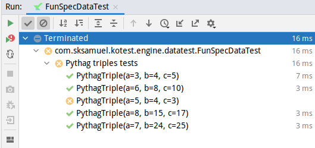

:::note
This section covers the new and improved data test support that was released with Kotest 4.6.0. To view the
documentation for the previous data test support, [click here](data_driven_testing_4.2.0.md)
:::

When writing tests that are logic based, one or two specific code paths that work through particular scenarios make
sense. Other times we have tests that are more example based, and it would be helpful to test many combinations of
parameters.

In these situations, **data driven testing** (also called table driven testing) is an easy technique to avoid tedious
boilerplate.

Kotest has first class support for data driven testing built into the framework.
This means Kotest will automatically generate test case entries, based on input values provided by you.

## Getting Started

Let's consider writing tests for a [pythagorean triple](https://en.wikipedia.org/wiki/Pythagorean_triple) function that
returns true if the input values are valid triples (_a squared + b squared = c squared_).

```kotlin
fun isPythagTriple(a: Int, b: Int, c: Int): Boolean = a * a + b * b == c * c
```

Data testing in Kotest is based on data classes, so we start by definining a data class that will hold a single _row_ of
values (in our case, the two inputs, and the expected result).

```kotlin
data class PythagTriple(val a: Int, val b: Int, val c: Int)
```

We will create tests by using instances of this data class, passing them into the `withData` function, which also
accepts a lambda that performs the test logic for that given _row_.

For example:

```kotlin
class MyTests : FunSpec({
  context("Pythag triples tests") {
    withData(
      PythagTriple(3, 4, 5),
      PythagTriple(6, 8, 10),
      PythagTriple(8, 15, 17),
      PythagTriple(7, 24, 25)
    ) { (a, b, c) ->
      isPythagTriple(a, b, c) shouldBe true
    }
  }
})
```

Notice that because we are using data classes, the input row can be destructured into the member properties.
When this is executed, we will have 4 test cases in our input, one for each input row.

Kotest will automatically generate a test case for each input row, as if you had manually written a seperate test case
for each.


The test names are generated from the data classes themselves but can be [customized](#custom-test-names).

If there is an error for any particular input row, then the test will fail and Kotest will output the values that
failed. For example, if we change the previous example to include the row `PythagTriple(5, 4, 3)`
then that test will be marked as a failure.



The error message will contain the error and the input row details:

`Test failed for (a, 5), (b, 4), (c, 3) expected:<9> but was:<41>`

In that previous example, we wrapped the `withData` call in a parent test, so we have more context when the test results appear.
The syntax varies depending on the [spec style](styles.md) used - here we used _fun spec_ which uses context blocks for containers.
In fact, data tests can be nested inside any number of containers.

But this is optional, you can define data tests at the root level as well.

For example:

```kotlin
class MyTests : FunSpec({
  withData(
    PythagTriple(3, 4, 5),
    PythagTriple(6, 8, 10),
    PythagTriple(8, 15, 17),
    PythagTriple(7, 24, 25)
  ) { (a, b, c) ->
    isPythagTriple(a, b, c) shouldBe true
  }
})
```


## Custom Test Names

By default, the name of each test is simply the `toString()` on the input row. This typically works well for data
classes.

However, we can customize this if we wish, by passing in test names into the `withData` function in the form of pairs.

```kotlin
context("Pythag triples tests") {
   withData<PythagTriple>(
      "3, 4, 5" to PythagTriple(3, 4, 5),
      "6, 8, 10" to PythagTriple(6, 8, 10),
      "8, 15, 17" to PythagTriple(8, 15, 17),
      "7, 24, 25" to PythagTriple(7, 24, 25)
   ) { (a, b, c) ->
      a * a + b * b shouldBe c * c
   }
}
```

The output from this example is now slightly clearer:


Another alternative is to implement the `WithDataTestName` interface. When provided, the `toString()` will not be
used, instead the `dataTestName` function will be invoked for each row.

```kotlin
data class PythagTriple(val a: Int, val b: Int, val c:Int) : WithDataTestName {
    override fun dataTestName() = "$a, $b, $c"
}
```

Finally, another option is to provide a function directly to the `withData` method.

```kotlin
context("Pythag triples tests") {
  withData<PythagTriple>(
    { "${it.a}, ${it.b}, ${it.c}" },
    PythagTriple(3, 4, 5),
    PythagTriple(6, 8, 10),
    PythagTriple(8, 15, 17),
    PythagTriple(7, 24, 25)
  ) { (a, b, c) ->
     a * a + b * b shouldBe c * c
  }
}
```

Whether this is worth the extra effort or not depends on how readable the toString() method is on the data classes you
are using.


