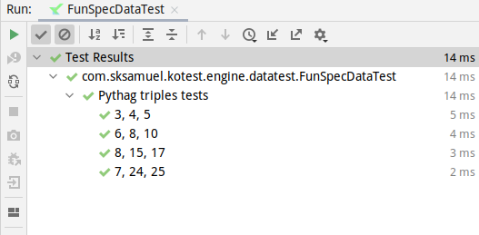

By default, the name of each test is simply the `toString()` on the input row. This typically works well for data
classes.

However, we can customize this if we wish, by passing in test names into the `withData` function in the form of pairs,
where the first element is the test name and the second element is the input value for that rorw.

```kotlin
context("Pythag triples tests") {
   withData<PythagTriple>(
      "3, 4, 5" to PythagTriple(3, 4, 5),
      "6, 8, 10" to PythagTriple(6, 8, 10),
      "8, 15, 17" to PythagTriple(8, 15, 17),
      "7, 24, 25" to PythagTriple(7, 24, 25)
   ) { (a, b, c) ->
      a * a + b * b shouldBe c * c
   }
}
```

The output from this example is now slightly clearer:



## WithDataTestName

Another alternative is to implement the `WithDataTestName` interface. When provided, the `toString()` will not be
used, instead the `dataTestName` function will be invoked for each row.

```kotlin
data class PythagTriple(val a: Int, val b: Int, val c:Int) : WithDataTestName {
    override fun dataTestName() = "$a, $b, $c"
}
```

## Test Name Function

Finally, another option is to provide a function directly to the `withData` method.

```kotlin
context("Pythag triples tests") {
  withData<PythagTriple>(
    { "${it.a}, ${it.b}, ${it.c}" },
    PythagTriple(3, 4, 5),
    PythagTriple(6, 8, 10),
    PythagTriple(8, 15, 17),
    PythagTriple(7, 24, 25)
  ) { (a, b, c) ->
     a * a + b * b shouldBe c * c
  }
}
```

Whether this is worth the extra effort or not depends on how readable the toString() method is on the data classes you
are using.

